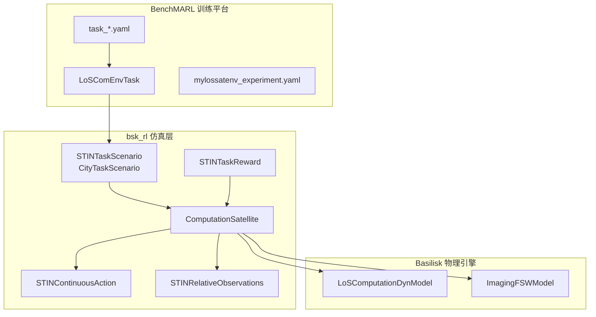

# mylossatenv 架构文档

## 概述

mylossatenv 是一个用于 **卫星-地面融合网络 (STIN)** 多智能体强化学习研究的仿真环境，
基于 BSK-RL 框架和 BenchMARL 训练平台。

## 系统架构



## 核心组件

### 1. 场景层 (`scene/stin_scenario.py`)
- **STINTaskScenario**: 均匀分布的计算任务
- **CityTaskScenario**: 基于城市人口分布的任务
- **泊松到达机制**: 动态任务生成

### 2. 卫星层 (`sats/computation_satellite.py`)
- **ComputationSatellite**: 计算节点智能体
- **TaskSlice**: 任务切片数据结构
- **时延模型**: 并行路径 (UD/SAT/CLOUD)

### 3. 数据层 (`data/stin_task_data.py`)
- **STINTaskData**: 增量数据记录
- **STINTaskStore**: 状态追踪
- **STINTaskReward**: 多目标奖励计算

### 4. 动作层 (`act/stin_continuous_actions.py`)
- 10D 连续动作空间
- 资源分配 + 层次化协作切分

### 5. 观测层 (`obs/stin_relative_observations.py`)
- 卫星状态 + 任务属性 + 邻居信息

## 数据流

```
环境初始化
    │
    ▼
任务生成 (Poisson)
    │
    ▼
观测构造 ──► 策略网络 ──► 动作输出
    │                         │
    ▼                         ▼
Basilisk 仿真步进      资源分配 & 任务切分
    │                         │
    ▼                         ▼
状态更新 ◄──────────── 任务执行
    │
    ▼
奖励计算 ──► 返回给训练器
```

## 配置参数

| 类别 | 参数 | 说明 |
|------|------|------|
| 星座 | `n_satellites`, `n_planes` | Walker delta 配置 |
| 任务 | `n_tasks`, `task_arrival_rate` | 任务规模和到达率 |
| 奖励 | `base_reward`, `delay_weight` | 奖励函数权重 |
| 仿真 | `max_step_duration`, `time_limit` | 时间控制 |

## 文件索引

- `bsk_rl/scene/stin_scenario.py` - 场景定义
- `bsk_rl/sats/computation_satellite.py` - 卫星智能体
- `bsk_rl/data/stin_task_data.py` - 奖励系统
- `bsk_rl/act/stin_continuous_actions.py` - 动作空间
- `bsk_rl/obs/stin_relative_observations.py` - 观测空间
- `bsk_rl/utils/constants.py` - 物理常量
- `BenchMARL/benchmarl/environments/mylossatenv/` - 配置集成
